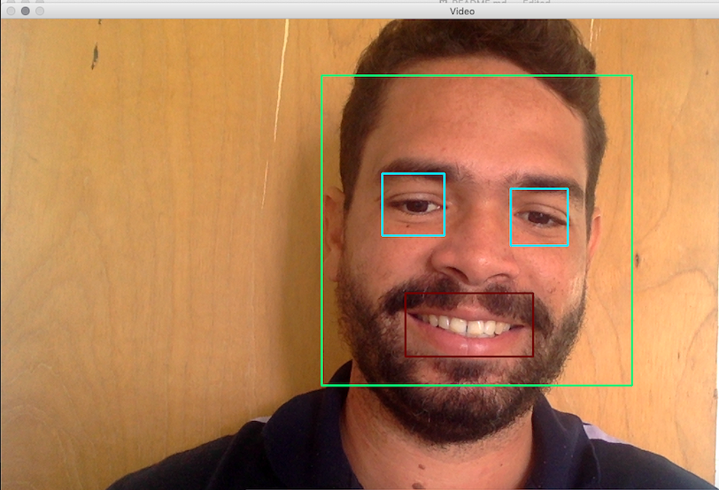

# Estudo Haar Cascade OpenCV

Repositório para estudo do Haar Cascade OpenCV. Usa a webcam para detectar Rosto, Olhos e Sorriso.

## Instalação

Utiliza o OpenCV@2 e a lib numpy.

## Exemplo

```
$ python webcam.py
```

